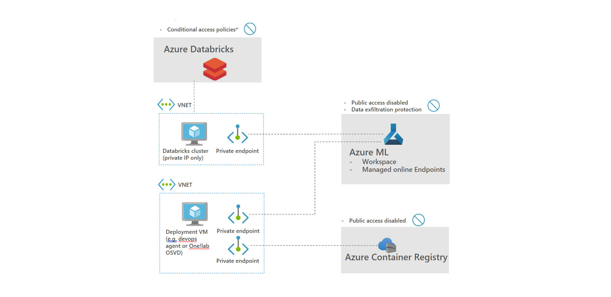
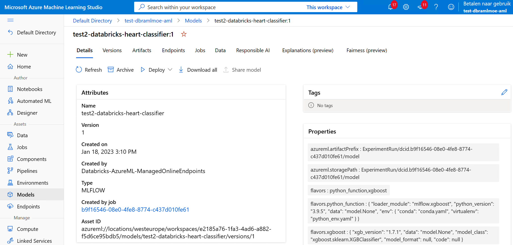
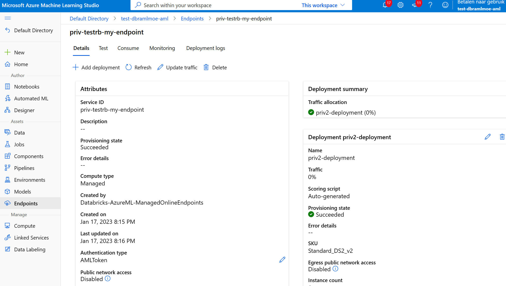
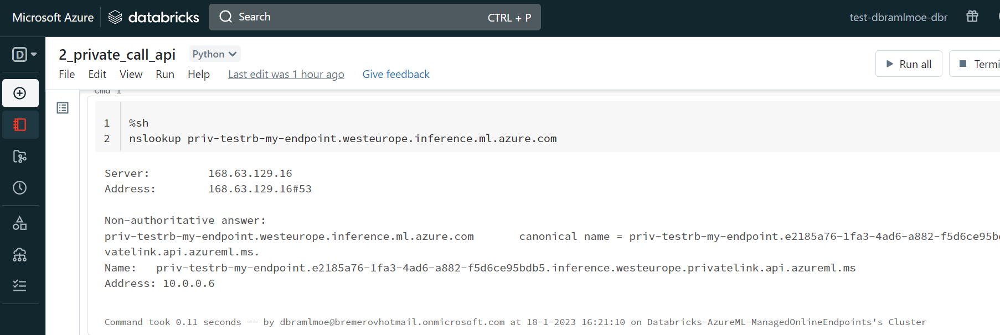

## Databricks-MLflow-Azureml-MoE-Vnet

Project to develop models in Databricks, use MLFlow to register models in AzureML with public access disabled, deploy models as private managed online endpoints. See also architecture below:

See also overview below:



Git repo is based on [this](https://learn.microsoft.com/en-us/azure/machine-learning/how-to-use-mlflow-azure-databricks?tabs=cli%2Cmlflow#tracking-exclusively-on-azure-machine-learning-workspace) documentation in which models are exclusively logged in Azure ML (single source of truth, only possibility when using Azure ML with public access disabled) and enhances documentation by created managed online endpoints with private endpoints and egress disabled using az cli v2.

Steps to take:

### 1. Prerequisites:

- Create Databricks workspace that is deployed in its own VNET. Make sure that VNET has 3 subnets: 1 default subnet and 2 subnets used by Databricks. It is not necessary to deploy Databricks with private link. See [here](https://learn.microsoft.com/en-us/azure/databricks/administration-guide/cloud-configurations/azure/vnet-inject)

- Create an Azure ML with public access disabled. Make sure an Azure Container Registry is deployed with public access disabled. See [here](https://learn.microsoft.com/en-us/azure/machine-learning/how-to-network-security-overview​)

- Create a jumphost Data Science VM in the VNET in which Databricks deployed. Use subnet default to deploy the VM. See [here](https://learn.microsoft.com/en-us/azure/machine-learning/data-science-virtual-machine/provision-vm) to create a DSVM that already has Visual Studio Code, Docker Azure CLI preinstalled

- Log into the DSVM and make sure the az ml cli v2 extension is installed (az extension add -n ml)

### 1. Create Model:

Now the resources are deployed and connectivy is setup, the model can be trained. The followings steps need to be taken:

- Use ```az ml workspace show --query mlflow_tracking_uri``` to fetch mlflow_tracking_uri, see also [cli](azcliv2_script.txt) for full script.

- Log in the Databricks workspace and import [notebook](Databricks/1_private_create_model_mlflow.ipynb). Use MLflow tracking URL in previous steps to log experiments and register models

When all steps are successfully run in notebook, an experiment is logged and a model is registed, see also screenshot below (access Azure ML from jumphost, since jumphost is in VNET that has private endpoint to AzureML)



### 2. Deploy Model as private Managed Online Endpoint

Now the model is created, the model can be deployed as online endpiont. The followings steps need to be taken:

-  Since Egress is disabled in Azure ML workspace, environment docker images cannot be fetched from mcr.microsoft.com. Instead, an image shall be created and put on the Azure Container Registry that is deployed as part of Azure ML. Run the commands in ```az acr login -n <<your Azure Container Registry>> . ``` and ```az acr build -t testrb-mlflow:latest -r <<your Azure Container Registry>> .az ml workspace show --query mlflow_tracking_uri``` to create and build model. See also [cli](azcliv2_script.txt)

- Create private endpoints using ```az ml online-endpoint create -f endpoint.yaml --set public_network_access=disabled``` and then deploy model to endpoint using ```az ml online-deployment create -f acr-gboost-deployment.yaml --set egress_public_network_access=disabled```. See also [cli](azcliv2_script.txt)

When Managed Online Endpoint is deployed successfully, endpoint is created in Azure ML, see also screenshot below (access Azure ML from jumphost, since jumphost is in VNET that has private endpoint to AzureML)



### 3. Test private endpoint

Now the endpoint is created, the endpoint shall be tested. Since endpoint is private, it shall be tested from the same network. This can either be done from the jumphost or Databricks. In this case, Databricks is used. The following steps need to be taken:

- Log in the Databricks workspace and import [notebook](Databricks/2_private_call_api.ipynb). Run the first cell to check whether DNS of managed online endpoint resolves to a private IP and then run second cell to test endpoint (JWT token can be fetched from Azure ML consume tab under endpoint in screenshot above )

When Managed Online Endpoint is tested succesfully, private ip is resolved and [0,0] is returned as prediction, see also screenshot below in which DNS is resolved




### Interesting links


- Azure ML secure workplace: https://learn.microsoft.com/en-us/azure/machine-learning/how-to-network-security-overview​
- Managed Online Endpoints VNET: https://learn.microsoft.com/en-us/azure/machine-learning/how-to-secure-online-endpoint​
- Azure Databricks private endpoints: https://learn.microsoft.com/en-us/azure/databricks/administration-guide/cloud-configurations/azure/private-link